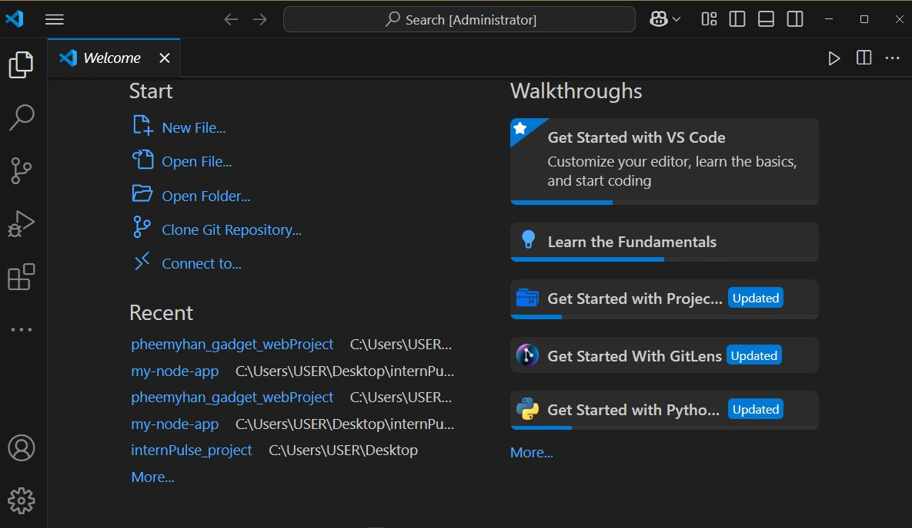
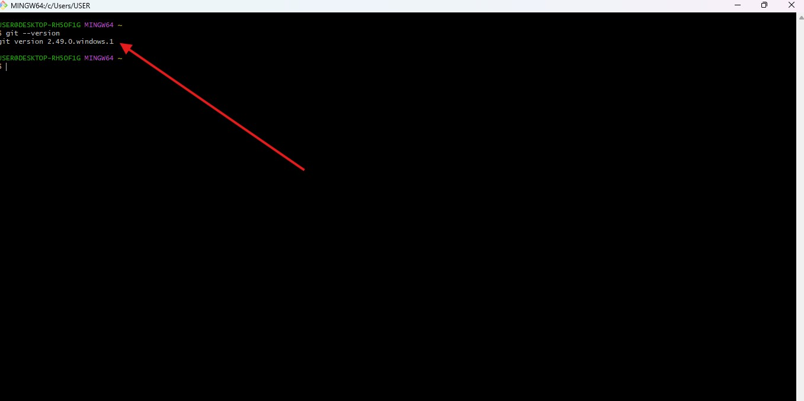
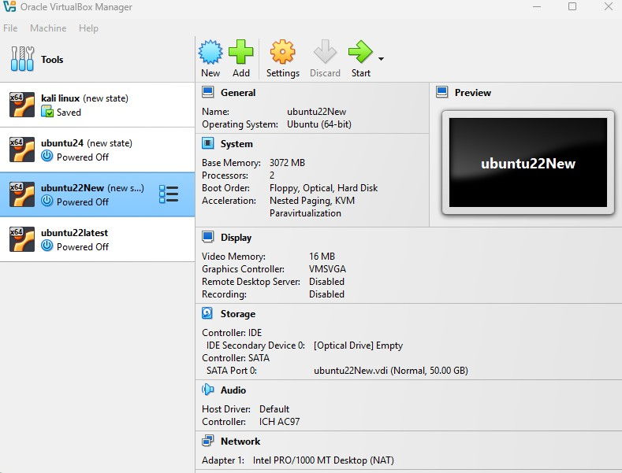
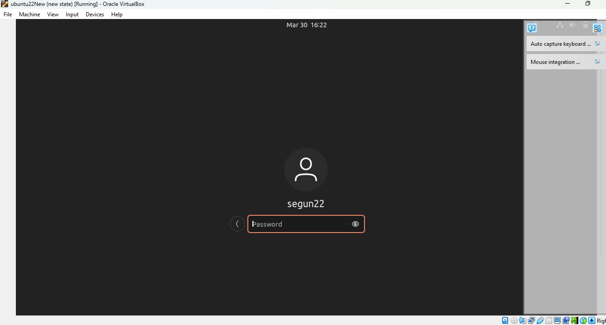
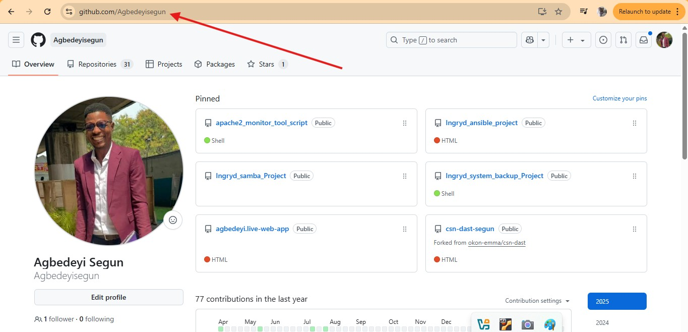
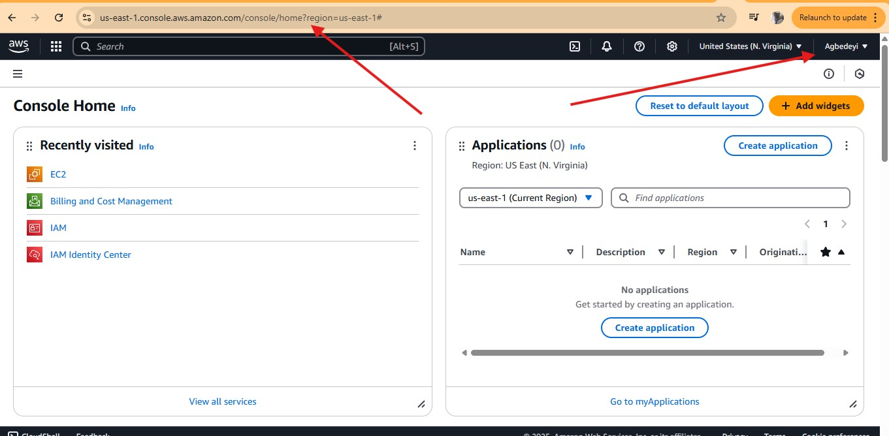

# TECH ENVIRONMENT SETUP 

## Tools Needed to  be Installed Below:

- Visual Studio Code(VScode)

- Git 

- Virtual Box

- Ubuntu on Virtual box(Windows)

## Account to be created Below: 

- Github Account 

- Amazon Web Services (AWS) Account

